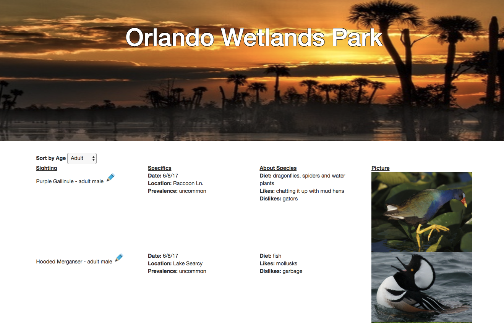

# Local Zoo Project - Orlando Wetlands Park

This is a web app built in Angular 2 without CLI or a database.
This app allows a user to track animals at a zoo, but I made it specifically in mind for Orlando Wetlands Park.
This is one of my all time favorite places and a wonderful sight for bird watching. You can track birds and other species with this app and specifically see adult, juvenile, or all sightings of animals.

## Screenshot

## Prerequisites

You will need the following things properly installed on your computer.

* [Git](http://git-scm.com/)
* [Node.js](http://nodejs.org/) (with NPM)
* [Bower](http://bower.io/)

## Installation

* `git clone <repository-url>` this repository
* `cd message-board`
* `npm install`
* `bower install`
* `apm install atom-typescript`
* `gulp build`

## Running / Development

* `gulp serve`
* Visit your app at [http://localhost:3000](http://localhost:3000).

## Technologies Used

* Angular2
* Typescript
* jQuery
* HTML/CSS/Bootstrap
* npm
* bower
* gulp

## Authors

Jennifer Kinsey

## License Information

MIT License

Copyright (c) 2017

Permission is hereby granted, free of charge, to any person obtaining a copy of this software and associated documentation files (the "Software"), to deal in the Software without restriction, including without limitation the rights to use, copy, modify, merge, publish, distribute, sublicense, and/or sell copies of the Software, and to permit persons to whom the Software is furnished to do so, subject to the following conditions:

The above copyright notice and this permission notice shall be included in all copies or substantial portions of the Software.

THE SOFTWARE IS PROVIDED "AS IS", WITHOUT WARRANTY OF ANY KIND, EXPRESS OR IMPLIED, INCLUDING BUT NOT LIMITED TO THE WARRANTIES OF MERCHANTABILITY, FITNESS FOR A PARTICULAR PURPOSE AND NONINFRINGEMENT. IN NO EVENT SHALL THE AUTHORS OR COPYRIGHT HOLDERS BE LIABLE FOR ANY CLAIM, DAMAGES OR OTHER LIABILITY, WHETHER IN AN ACTION OF CONTRACT, TORT OR OTHERWISE, ARISING FROM, OUT OF OR IN CONNECTION WITH THE SOFTWARE OR THE USE OR OTHER DEALINGS IN THE SOFTWARE.
